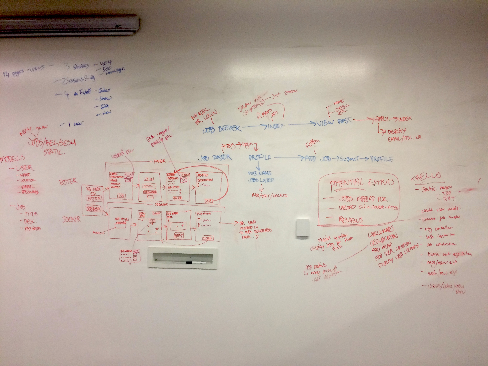

# BARZURK

[Check out BARZURK](https://desolate-hamlet-32222.herokuapp.com/)

A Restful Web App for people who are looking jobs at a local pub.

People can either view the map and see which pubs have jobs available, or they can register, login and upload, edit and delete job posts from their profile page.

### The idea
The aim was to create a site that allowed people to see on a map which pubs around them are looking for staff, rather than having to go into every pub and ask if they are looking to hire.

## The wireframe

For the wireframe, I had a general idea of how I wanted it to look, but I was more into working out how each page would be linked and the different routes some looking for a job would take and what a pub owner would take.

## The coding process

#### What was used:
* Node
* Express
* HTML5
* SCSS

### Creating a Restful foundation
I over complicated the code when I first started, and focussed on how I wanted the end product to look without thinking of how it would work.

I started from scratch and aimed on just getting a basic Restful foundation down, so people could register, login, post things, edit them and delete them.

After that was done, I tailored the models and views more towards job posting.

### Adding the APIs
I then implemented the map and geolocation APIs and plotted the locations of the users (that I added into the seeds file).

I used the standard Google Maps API and the Geolocation API to find where the user is and zoom in on their location.

### Styling
I styled in small amounts while coding the functionality just so I could to see the progress and start narrowing in on how I wanted it to end up looking.

### What went well...
I think the styling went well and didn't take too long to do.

### What went badly...
Apart from the initial start, nothing went particularly badly, although I did have a lot of help of various parts of the project.

### If I had more time...
I would add more features to the 'View Jobs' page such as auto filling the registration address form, filtering jobs, adding directions, etc. I would also have liked to add how many different positions the pub has to the info window above the map markers.
